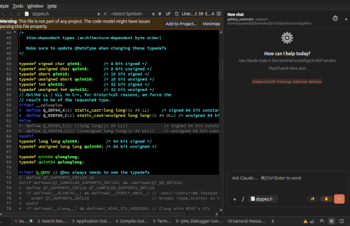

# QClaude  Claude Code panel for Qt Creator

[](https://github.com/Diackne/qt-qclaude-plugin/actions/workflows/build.yml)
[](https://github.com/super-linter/super-linter)
[](https://github.com/Diackne/qt-qclaude-plugin/actions/workflows/codeql.yml)
[](https://github.com/Diackne/qt-qclaude-plugin/releases)
[](LICENSE)
[](https://www.qt.io/product/development-tools)
[](#requirements)

A free, open-source Qt Creator plugin that embeds [Claude Code](https://docs.claude.com/en/docs/claude-code) as a chat panel in Qt Creator's **right pane**, toggled from a theme-aware status-bar icon. It runs the `claude` CLI in the context of your current project (or the directory of the file you have open), streams the conversation token-by-token into a native Qt widget, and resumes the same session across turns and across Qt Creator restarts.



> **Status:** experimental. Tested with Qt Creator 19.0.0 and Claude Code 2.1.x on Linux. CI builds Linux and Windows.

Repo: https://github.com/Diackne/qt-qclaude-plugin

---

## Index

- [Features](#features)
  - [Chat UI](#chat-ui)
  - [Composer](#composer)
  - [AI Complete (inline editor autocomplete)](#ai-complete-inline-editor-autocomplete)
  - [Right-click integration](#right-click-integration)
  - [Persistence and configuration](#persistence-and-configuration)
  - [No WebEngine](#no-webengine)
- [Requirements](#requirements)
- [Build](#build)
  - [Convenience: `RunQtCreator` target](#convenience-runqtcreator-target)
  - [Continuous integration](#continuous-integration)
- [Install](#install)
  - [Per-user (recommended)](#per-user-recommended)
  - [System-wide](#system-wide)
- [Usage](#usage)
  - [Keyboard shortcuts](#keyboard-shortcuts)
  - [Composer toolbar](#composer-toolbar)
- [How it works](#how-it-works)
- [Project layout](#project-layout)
- [Configuration](#configuration)
- [Troubleshooting](#troubleshooting)
- [Contributing](#contributing)
- [License](#license)

---

## Features

### Chat UI

- **Status-bar toggle.** A small Claude icon (themed via `Utils::Theme::IconsBaseColor`, rendered from a bundled SVG and tinted with the active theme color) lives in the bottom-right corner of Qt Creator's status bar. Click it to open or close the chat in Qt Creator's right-pane dock.
- **Welcome state with logo + suggestion chips.** A fresh chat (or every *New chat*) shows a centered hero block: the QClaude logo (the bundled SVG, tinted via `Utils::Theme::IconsBaseColor`), a bold **"How can I help today?"** headline, the MCP-servers note, and four clickable starter chips  *Explain this file*, *Find bugs*, *Add tests*, *Refactor*  that prefill the composer when clicked.
- **Refined header.** Title (auto-derived from the first prompt), project · file · cwd context line directly underneath, a compact **session-usage badge** (`NN%` of the context window, plus `· resets HH:MM` when the CLI surfaces a rate-limit reset), and a **⏱ history** menu and **+** new-chat button on the right. The badge is per-project, persisted in settings, and restored on launch.
- **Busy strip.** A 4-px Claude-warm progress bar pulses just under the header while a turn is in flight, and disappears the moment the turn ends no leftover progress sitting at the top of the panel.
- **Timeline rail.** Each turn renders along a continuous left-side rail with colored bullets gray for thinking / system, green for tool use (Read, Bash, Glob, …), red for Edit / Write / errors, blue for user.
- **Token-by-token streaming** via `--include-partial-messages`. Assistant text appears character-by-character as the model produces it, with deduplication against the consolidated `assistant` event.
- **Inline code chips.** All `<code>` spans (and Claude's `bin/bash`, `-c`, `Edit`, `/`, …) render as rounded chip-style pills.
- **Bash IN/OUT cards.** When Claude runs a shell command, the tool_use renders as a code card with an `IN` badge for the command and an `OUT` badge for the result, paired automatically.
- **Compact tool subtext.** Non-Bash tool calls (Read, Glob, Grep, Edit, …) show their result as a small muted line directly under the tool's own row (e.g. `Glob pattern: "**/*.cpp"` → `Found 1 file`). No standalone `[OUT]` row, no rail-spam.
- **Edit / Write cards.** Each Edit or Write call produces an inline rail card with monospace path, `+N / −N` line stats, and `Show diff` / `Revert` links.
  - **Show diff** opens Qt Creator's native side-by-side diff viewer (`DiffEditor::DiffEditorController`) populated from a line-mode `Utils::Differ` of the captured before/after states.
  - **Revert** undoes the change on disk: for `Edit` it splices `new_string` → `old_string`; for `Write` it restores the snapshot we captured (or removes the file if Claude created it).
  - **Selective per-chunk apply.** Right-click any chunk in the diff viewer to *Revert this chunk (Claude)* or *Keep only this chunk (revert all others)*. The plugin walks the chunk's `RowData`, computes the actual change range (skipping context rows), splices the before-side lines back into the on-disk file, writes it, and refreshes the diff in place.
- **MCP-aware pre-flight permission gate** for every Edit / Write *and* MCP tool call when the **✋ Ask before edits** chip is on. The plugin spawns a small `qclaude_mcp_permission` helper as an MCP stdio server and launches Claude with `--mcp-config <generated>` and `--permission-prompt-tool mcp__qclaude_perm__permission_prompt`; when Claude is about to call a gated tool, the helper connects back to the panel's `QLocalServer`, the panel renders an inline **Allow / Deny** card in the chat, and Claude is paused until you click. Deny means the tool is *never invoked* no revert needed, no transient on-disk state. The chip also flips Claude's `--permission-mode` to `default` so the prompt tool actually fires for Edit/Write (`acceptEdits` would short-circuit before consulting it). Falls back gracefully to the post-hoc "modify-then-revert" Yes/No dialog when the helper can't be located, and the helper fails open if the plugin is unreachable so a crashed panel never strands a turn.

### Composer

- **Polished input box.** 12-px rounded panel with a soft Claude-warm focus glow (`rgba(217,119,87,0.7)`) when the textarea takes focus. Driven by a dynamic `focused` Qt property + style polish on `FocusIn`/`FocusOut`. Placeholder reads `Ask Claude…   ⌘/Ctrl-Enter to send`.
- **Header.** Title (auto-derived from your first prompt), session-history menu (resume past chats from this run), and a **+** new-chat button.
- **Current-file chip.** A pill in the bottom toolbar shows the active editor's filename (e.g. `docker-compose.yml`). Checked by default; while checked, every prompt is sent with `@<rel-path>` prepended automatically. Click to detach (chip dims) or re-attach.
- **Smart `+` add menu.** Instead of a plain file dialog, the **+** button pops a context-aware menu:
  - *Current file · `<rel/path>`*
  - *Current selection · `<rel/path>` (lines N–M)*  when the editor has a selection; inserts `@rel/path#L<n>-<m>` plus a fenced code block of the selected text.
  - *Current line · `<rel/path>` (line N)*  inserts `@rel/path#L<n>` for the cursor line.
  - *Open editors ▸*  submenu listing every other open editor in Qt Creator.
  - *Search files in project… `@`*  opens the inline fuzzy file picker (see *@-mention file picker* below).
  - *Browse files…*  multi-select file dialog fallback.
  - *Add working directory · `<cwd>`*  inserts `@<cwd>` to scope Claude to the whole project root.
- **`@`-mention fuzzy file picker.** Type `@` in the composer to pop a small Locator-style list of every source file in the active project, anchored above the input. As you keep typing (`@foo`), the list re-ranks via a subsequence-style fuzzy matcher that gives extra weight to consecutive runs, word-start hits, and basename matches over full-path matches. Arrow keys navigate, **Tab** or **Enter** inserts the chosen `@<rel-path>`, **Esc** dismisses, clicking outside also dismisses. Indexed lazily from `Project::files(SourceFiles)` and refreshed when the active project changes.
- **Section-grouped `/` command menu.** Sections for **Context**, **Model**, **Account**, **Help**:
  - *Context:* Attach file…, /clear, New chat
  - *Model:*
    - **Chat: Switch model… `<current>`** ▸  Opus 4.7 (1M), Sonnet 4.6, Haiku 4.5, or *(CLI default)*.
    - **AI Complete model… `<current>`** ▸  *Use chat model* (inherit) or one of Opus 4.7 / Sonnet 4.6 / Haiku 4.5. Independent of the chat model.
    - /cost.
  - *Account:* /login, /logout, /status
  - *Help:* /help, *QClaude settings…* (opens the IOptionsPage directly).
- **✋ Ask before edits / ⚡ Auto-accept edits** chip  toggles the pre-flight permission gate. **On:** Claude is launched with `--permission-mode default` and `--permission-prompt-tool mcp__qclaude_perm__permission_prompt`, and every Edit / Write / MultiEdit / NotebookEdit *and* MCP tool call (`mcp__*`) opens an inline Allow / Deny card before the tool actually runs. **Off:** Claude runs in `acceptEdits` and writes apply silently. Icon-only by default; expands to the full label on hover.
- **✨ AI Complete** chip  toggles inline ghost-text autocomplete in the editor (see *AI Complete* below). Icon-only with hover-expand; turns into **⏳** while a request is in flight.
- **↑ Send** / **■ Stop**  pill-shaped, warm-accent (`#d97757`) Send / red Stop. `Ctrl+Enter` sends.

### AI Complete (inline editor autocomplete)

- Toggle the **✨ AI Complete** chip in the composer to enable. Then in any code editor:
  1. Type and pause for ~600 ms with the caret at end-of-line (or anywhere where the next character isn't part of an identifier; trailing plain-space pauses are also skipped).
  2. The chip turns into **⏳** and the suggestion **streams in token-by-token** as faded italic ghost text at your caret. Your cursor stays where you left off; the ghost grows as new chunks arrive.
  3. When the stream finishes, the ghost is cleanly replaced with the post-processed final text (markdown fences stripped, trailing newlines trimmed) so accepting always lands the canonical version.
  4. **Tab** accepts (the inserted text is reformatted with the editor's default `QTextCharFormat` so the syntax highlighter recolors it), **Esc** dismisses, any other keystroke / mouse click also dismisses cleanly and cancels the in-flight stream so we stop generating tokens you've already moved past.
  5. **Alt+\\** triggers manually if you don't want to wait.
- Independent model: defaults to **Haiku 4.5** for snappy completions, picked under the `/` menu's *AI Complete model* submenu (or in *Tools → Options → AI → Claude*). Pick *Use chat model* to inherit from the chat side instead.
- **Streaming engine.** Each request spawns a `claude -p --output-format stream-json --verbose --include-partial-messages` subprocess with `--max-turns 1` and `--disallowed-tools` covering every built-in tool, so the model goes straight to producing code with no tool detours. The plugin parses `text_delta` events as they arrive and emits a `partial(chunk)` signal that the panel folds into the growing ghost-text span first tokens land in ~300 ms instead of waiting for the full result.
- **Pre-warmed worker pool.** A single `claude -p` worker is kept hot in the background, blocked on stdin. When a request arrives, that warm worker is promoted to active (skipping ~500 ms–2 s of Node + CLI cold start) and a fresh warm worker is spawned while the result streams. The first request after launch / model change still pays cold start; everything after lands sub-second to first byte. The pool is dropped automatically when the executable path or autocomplete model changes.
- Context window is 100 lines before and 30 after the caret, prompt is intentionally tiny to minimise time-to-first-byte.
- **In-memory LRU cache** (64 entries, keyed by `(lang, model, prefix, suffix)`). Repeat triggers e.g. backspace + retype, caret bouncing back to the same column, manual `Alt+\` after a missed pause return the previous suggestion instantly without re-spawning a subprocess. Cleared automatically when you switch the autocomplete model.
- Race-safe: each in-flight request remembers the caret position; if you move the caret while waiting, the result is discarded so a stale completion never lands in the wrong place. Mid-stream dismissal also cancels the subprocess so usage isn't billed for tokens you'll never see.

### Right-click integration

- **Editor:** *Ask Claude about selection / file*  prefills the input with `@<rel-path>` and the highlighted code in a fenced block (or `#L<n>` line refs when there is no selection).
- **Project tree:** *Ask Claude about this file*  prefills `@<rel-path>` for the selected file or folder.

### Persistence and configuration

- **Per-project session persistence.** The `session_id` is saved per project key (project root path, SHA1-hashed) under `Core::ICore::settings()` group `QClaude/Sessions`, and resumed automatically the next time you open Qt Creator on that project. *New chat* clears the saved entry for the active project.
- **Per-project usage snapshot.** The last context-token total, max-context estimate, and rate-limit reset epoch are stored alongside the session under `QClaude/Usage`, so the header badge shows the right `NN%` immediately on launch instead of staying blank until the next turn. Cleared by *New chat*.
- **Settings page** (`Tools → Options → AI → Claude`):
  - **Notice**  a top-of-page disclaimer about agreement with applicable Anthropic / Claude terms, code rights, and acknowledgement of implications (copyright, accuracy).
  - **Getting started**  install (`npm install -g @anthropic-ai/claude-code`), authenticate (`claude` from a terminal, or the panel's *Log in to Claude* button), `PATH` fallback, and a couple of links to the canonical docs.
  - Custom **executable path** with a Browse… button and a live "Resolved: …" preview that mirrors auto-detect.
  - **Default model**  free-form; empty falls back to the CLI's default. The `/` command menu writes here when you switch.
  - **Default permission mode**  `default` (ask) / `acceptEdits` / `plan` / `bypassPermissions`. Seeds the chip on startup: `default` arms it (Claude runs in `--permission-mode default` with the MCP permission helper) and `acceptEdits` disarms it (Claude runs in `--permission-mode acceptEdits`, writes auto-apply). `plan` and `bypassPermissions` are forwarded verbatim and override the chip.
  - **Autocomplete model**  independent of the chat model. Combo of *Use chat model* / *Haiku 4.5 (fastest)* / *Sonnet 4.6* / *Opus 4.7 (1M)*; the combo is editable so custom model ids work too. Falls back to Haiku 4.5 when neither this nor the chat model is set.
- **Project / file aware.** Each prompt runs `claude` in the current project's root. Without a project, it falls back to the directory of the active editor. When the chat hasn't been used yet, switching project swaps the panel to that project's stored session.
- **Browser login.** Authentication is delegated to the `claude` CLI itself the panel exposes a *Log in to Claude* button that runs `claude auth login`, which opens your browser.

### No WebEngine

Pure `QtWidgets` + `QtSvg`. No bundled Chromium.

---

## Requirements

| Component         | Version           | Notes                                                                |
| ----------------- | ----------------- | -------------------------------------------------------------------- |
| Qt Creator        | 19.0.0            | The plugin links against the QC 19 API. Other versions need a rebuild. |
| Qt                | 6.10.x            | Whatever Qt your Qt Creator was built with typically bundled. Modules: Widgets, Svg. |
| CMake             | ≥ 3.16            |                                                                      |
| C++ compiler      | C++20             | GCC 13, Clang 16, or MSVC 19.30+ recommended.                        |
| `claude` CLI      | 2.1.x or newer    | Install via `npm i -g @anthropic-ai/claude-code` or the native installer. The plugin auto-detects `~/.local/bin/claude`, `~/.claude/local/claude`, `/usr/local/bin/claude`, `/usr/bin/claude`, or anything on `PATH`. Override under *Tools → Options → AI → Claude*. |
| Claude account    | Pro / Team / API  | Required by the CLI itself.                                          |

## Build

```bash
git clone https://github.com/Diackne/qt-qclaude-plugin.git
cd qt-qclaude-plugin
cmake -B build \
    -DCMAKE_PREFIX_PATH="/path/to/Qt/6.10.1/gcc_64;/path/to/Qt/Tools/QtCreator" \
    -DCMAKE_BUILD_TYPE=RelWithDebInfo
cmake --build build -j
```

The built plugin lands in:

```text
build/lib/qtcreator/plugins/libQClaude.so          # Linux
build/lib/qtcreator/plugins/QClaude.dll            # Windows
build/lib/qtcreator/plugins/qclaude_mcp_permission # MCP permission helper (sibling of the .so)
build/lib/qtcreator/plugins/qclaude_hook_bridge    # legacy PreToolUse helper, no longer wired up
```

The helpers must travel with the plugin the panel resolves them by their absolute path next to the loaded `libQClaude.so`. If you copy only the `.so`, the **✋ Ask before edits** chip falls back to its post-hoc Yes/No dialog instead of the pre-flight gate.

### Convenience: `RunQtCreator` target

The CMake project defines a `RunQtCreator` custom target that launches your Qt Creator with the freshly built plugin loaded:

```bash
cmake --build build --target RunQtCreator
```

This is equivalent to:

```bash
/path/to/Qt/Tools/QtCreator/bin/qtcreator \
    -pluginpath build/lib/qtcreator/plugins
```

### Continuous integration

`.github/workflows/build.yml` runs a fail-fast=false matrix on **`ubuntu-22.04`** and **`windows-2022`**. It uses `jurplel/install-qt-action` for Qt 6.10.1 and `aqtinstall`'s `tools_qtcreator` for Qt Creator (the dev headers ride along as a sub-archive in current aqt). MSVC is initialized via `ilammy/msvc-dev-cmd`. Each platform's plugin artifact (`.so` / `.dll`) plus both gate helpers (`qclaude_mcp_permission`, `qclaude_hook_bridge`) and the generated `QClaude.json` are uploaded for 14 days.

## Install

### Per-user (recommended)

Copy the built plugin into your Qt Creator user plugin directory:

| OS      | Path                                                                    |
| ------- | ----------------------------------------------------------------------- |
| Linux   | `~/.local/share/QtProject/Qt Creator/plugins/`                          |
| Windows | `%APPDATA%\QtProject\Qt Creator\plugins\`                               |

```bash
# Linux example copy the plugin AND the MCP helper. The pre-flight
# permission gate looks for qclaude_mcp_permission as a sibling of the
# loaded libQClaude.so; without it the chip falls back to a post-hoc dialog.
mkdir -p ~/.local/share/QtProject/Qt\ Creator/plugins
cp build/lib/qtcreator/plugins/libQClaude.so \
   build/lib/qtcreator/plugins/qclaude_mcp_permission \
   ~/.local/share/QtProject/Qt\ Creator/plugins/
```

Restart Qt Creator. If the plugin doesn't show up, enable it under **Help → About Plugins…** and restart.

### System-wide

Drop the binary next to the bundled plugins (requires admin / root):

```text
<QtCreator install>/lib/qtcreator/plugins/
```

## Usage

1. Open Qt Creator. Look for the small Claude icon in the **bottom-right corner of the status bar** click it to toggle the chat panel in the right pane.
2. The panel header shows your current chat title and gives you a **history** menu and a **new chat** button. The line beneath shows your current project, current file, and the working directory the CLI will use.
3. The bottom toolbar's chip shows the **current file** by default it's auto-attached as `@<rel-path>` to every prompt; click to detach.
4. Type your prompt and press **`Ctrl+Enter`** (or click the **↑** Send button).
5. First time only: if `claude` is not yet authenticated, click **Log in to Claude** it opens the CLI's browser-OAuth flow. Come back here once it's done.
6. **Right-click a file in the project tree** or **a selection in the editor** to use *Ask Claude about …*; the panel opens with the file (and selected lines) prefilled into the input.
7. When Claude does an Edit or Write, an inline card appears in the chat with `Show diff` / `Revert` links. With **✋ Ask before edits** on, a non-modal Yes/No popup also asks for explicit approval *Yes* keeps it, *No* reverts.

> **Session persistence:** the `session_id` is stored per project. The next time you open Qt Creator on that project and click the icon, the previous conversation is resumed automatically. Use *New chat* to forget it for the current project.

### Keyboard shortcuts

| Action                                          | Shortcut       |
| ----------------------------------------------- | -------------- |
| Send the current prompt                         | `Ctrl+Enter`   |
| Trigger AI Complete at the editor caret         | `Alt+\`        |
| Accept the AI Complete ghost suggestion         | `Tab`          |
| Dismiss the AI Complete ghost suggestion        | `Esc`          |
| Open the @-mention fuzzy file picker (composer) | `@`            |
| Navigate the file picker                        | `↑` / `↓`      |
| Insert the highlighted file as `@<rel-path>`    | `Tab` / `Enter`|
| Dismiss the file picker                         | `Esc`          |

> Tip: in *Tools → Options → Environment → Keyboard*, you can bind any shortcut to `QClaude.AskAboutSelection` (editor), `QClaude.AskAboutFile` (project tree), or `QClaude.TriggerCompletion` (manual AI Complete trigger).

### Composer toolbar

| Button                            | Action                                                                                  |
| --------------------------------- | --------------------------------------------------------------------------------------- |
| **+** (header, top right)         | New chat clears the view, forgets the current `session_id`, clears the project's saved session, and re-shows the welcome state. |
| **⏱ History**                     | Pop a menu of recent sessions in this run; click to resume one.                         |
| **+** (composer, bottom-left)     | Smart add menu current file / selection / line / open editors / search files / browse / working dir. |
| **`@` in the composer**           | Pops the fuzzy file picker type to filter, arrow keys to navigate, Tab/Enter to insert `@<rel-path>`. |
| **/** (composer)                  | Section-grouped command menu Context · Model (chat & AI Complete) · Account · Help.   |
| **📄 `<filename>`** (chip)        | Toggle whether the current editor's file is auto-attached as `@<path>` to your next prompt. |
| **✨ AI Complete / ⏳ Completing** | Toggle inline ghost-text autocomplete in the editor (Tab to accept, Esc to dismiss; Alt+\\ triggers manually). |
| **✋ Ask before edits / ⚡ Auto-accept edits** | Toggle the MCP-aware pre-flight permission gate (Allow/Deny card for Edit/Write/MultiEdit/NotebookEdit and any `mcp__*` tool). Off → Claude auto-accepts. |
| **↑ Send / ■ Stop**               | Send the prompt / stop the running turn.                                                |

## How it works

```text
┌──────────────────────────┐         ┌──────────────────────────┐
│ Qt Creator right pane    │  spawn  │ claude (CLI subprocess)  │
│   QClaudePanel           ├────────▶│   -p                     │
│   QTextBrowser (chat)    │ stdin   │   --output-format        │
│   QPlainTextEdit (input) │  prompt │     stream-json          │
│   ClaudeProcess (QProc)  │ stdout  │   --verbose              │
│                          │◀────────┤   --include-partial-msgs │
│   stream-json parser     │  events │   [--resume <session>]   │
│   diff / revert helpers  │         │   [--model <id>]         │
└──────────────────────────┘         │   [--permission-mode …]  │
                                     └──────────────────────────┘
```

- The status-bar `QToolButton` is registered with `Core::StatusBarManager::addStatusBarWidget(..., RightCorner)`; toggling it sets `Core::RightPaneWidget::instance()->setWidget(panel)` and `setShown(true)`.
- The icon is rendered from `:/qclaude/icon.svg` via `QSvgRenderer` and tinted with `Utils::Theme::IconsBaseColor` using `QPainter::CompositionMode_SourceIn`. Both 1× and 2× DPRs are baked into the `QIcon`.
- `--include-partial-messages` makes Claude Code emit Anthropic streaming events (`stream_event` with `content_block_delta`/`text_delta`). The parser forwards each delta as `assistantText` so the panel rerenders only the trailing rail-row table.
- `Edit` and `Write` tool calls are intercepted in `ClaudeProcess::handleEvent`: the file is read off disk *before* Claude reports back, the snapshot + new content are emitted as `editToolApplied`, and the panel renders the inline card.
- `qclaudediff.{h,cpp}` builds a `DiffEditor::FileData` from `Utils::Differ` (LineMode) + `DiffUtils::calculateOriginalData/calculateContextData`, attaches it to a `QClaudeDiffController` (subclass of `DiffEditor::DiffEditorController`), and activates the document with `Core::EditorManager`. The controller stores the *before* snapshot and overrides `addExtraActions` so right-clicking a chunk surfaces *Revert this chunk* and *Keep only this chunk*. Per-chunk revert walks the chunk's `RowData`, computes the actual change range (skipping leading/trailing context rows), splices the before-side lines back into the on-disk file, writes it, and refreshes the diff in place.
- `qclaudehookserver.{h,cpp}` (`HookServer`) and the standalone `qclaude_mcp_permission` helper implement the pre-flight permission gate. The plugin starts a `QLocalServer` on a per-process socket name and writes a temp `mcp-config.json` registering the helper as an MCP stdio server (`qclaude_perm`); claude is then launched with `--mcp-config <that file>` and `--permission-prompt-tool mcp__qclaude_perm__permission_prompt`. The helper is a tiny line-delimited JSON-RPC server: it answers `initialize` / `tools/list` / `tools/call` and, for each `permission_prompt` invocation, gates Edit/Write/MultiEdit/NotebookEdit and any `mcp__*` tool by relaying to the plugin socket and waiting for the user's Allow/Deny click every other tool auto-allows. The user's answer is JSON-stringified into Claude's `permissionDecision` schema (`{"behavior":"allow","updatedInput":…}` or `{"behavior":"deny","message":…}`). The helper fails open on socket / timeout errors so an unreachable plugin never strands a turn. The older `qclaude_hook_bridge` is still built but no longer wired up by the panel.
- `qclaudefilepicker.{h,cpp}` (`FilePicker`) is the `@`-mention fuzzy picker. The composer watches its own text changes for an unfinished `@<query>` token (walks back from the caret to the most recent `@` whose preceding char is whitespace), feeds the query to the picker, and intercepts arrow / Tab / Enter / Esc only while the popup is visible. The index is built once per project from `ProjectExplorer::Project::files(SourceFiles)`; ranking is a subsequence-style fuzzy score with bonuses for consecutive runs, word-starts, and basename hits over full-path hits.
- `qclaudeautocomplete.{h,cpp}` (`AutocompleteEngine`) handles inline AI Complete. It spawns `claude -p --output-format stream-json --verbose --include-partial-messages` with `--max-turns 1` and `--disallowed-tools` covering every built-in tool, line-buffers stdout, and emits `partial(chunk)` for each `text_delta` event plus a final `completion(text)` once the `result` event lands. A single warm `claude -p` worker is kept blocked on stdin between requests so subsequent triggers skip Node + CLI cold start. The panel debounces editor `textChanged` (600 ms), grows a faded italic `QTextCharFormat` ghost span as deltas arrive, and on completion does a clean replace with the post-processed final text; Tab merges a clean format so the syntax highlighter recolors it on rehighlight. User dismissal (Esc / keystroke / mouse) cancels the in-flight subprocess.
- Session continuity: the first `system / init` event yields a `session_id`; subsequent prompts include `--resume <session_id>`. The id is persisted per project under the `QClaude/Sessions` group of `Core::ICore::settings()`.
- Right-click actions are registered via `Core::ActionBuilder` and added to `TextEditor::Constants::M_STANDARDCONTEXTMENU`, `ProjectExplorer::Constants::M_FILECONTEXT`, and `M_FOLDERCONTEXT`.
- All authentication and credential storage is handled by the `claude` CLI the plugin never touches API keys.

## Project layout

```text
qt-qclaude-plugin/
├── .github/workflows/build.yml     # Linux / Windows CI matrix
├── CMakeLists.txt
├── LICENSE                         # MIT
├── QClaude.json.in                 # plugin metadata template
├── README.md
├── helpers/
│   ├── qclaude_mcp_permission.cpp  # MCP stdio server backing --permission-prompt-tool
│   └── qclaude_hook_bridge.cpp     # legacy PreToolUse hook relay (no longer wired up)
├── resources/
│   ├── qclaude.svg                 # source SVG (theme-tinted at runtime)
│   └── qclaude.qrc
└── src/
    ├── qclaudeplugin.cpp           # IPlugin entry point: status bar, themed icon,
    │                               #   right-click actions, options page hookup,
    │                               #   Alt+\ trigger for AI Complete
    ├── qclaudepanel.{h,cpp}        # the chat UI widget (welcome state, rail rendering,
    │                               #   composer, smart add menu, section command menu,
    │                               #   edit confirmations, AI Complete ghost text)
    ├── qclaudesettings.{h,cpp}     # persistent settings + IOptionsPage (incl. autocomplete model)
    ├── qclaudediff.{h,cpp}         # Show diff / per-chunk revert atop DiffEditor + Utils::Differ
    ├── qclaudeautocomplete.{h,cpp} # one-shot claude subprocess for inline editor completions
    ├── qclaudefilepicker.{h,cpp}   # @-mention fuzzy file picker (Locator-style popup)
    ├── qclaudehookserver.{h,cpp}   # plugin-side QLocalServer for the MCP permission helper
    ├── claudeprocess.{h,cpp}       # claude CLI driver + stream-json parser
    │                               #   (incl. partial messages and Edit/Write capture)
    ├── qclaudeconstants.h
    └── qclaudetr.h
```

## Configuration

Open **Tools → Options → AI → Claude**:

- **Executable**  leave empty for auto-detect, or browse to a custom `claude` binary.
- **Default model**  e.g. `claude-sonnet-4-6`, `claude-opus-4-7`. Empty = CLI default.
- **Default permission mode**  `default` (ask) / `acceptEdits` / `plan` / `bypassPermissions`. The composer's *Ask before edits* chip seeds from this on startup.
- **Autocomplete model**  independent of the chat model. Combo of *Use chat model* / *Haiku 4.5 (fastest)* / *Sonnet 4.6* / *Opus 4.7 (1M)*; editable so custom model ids work too. Resolves to Haiku 4.5 if neither this nor the chat model is set.

All values are stored in `Core::ICore::settings()` under the `QClaude` group; the per-project `session_id` table lives under `QClaude/Sessions`, and the per-project usage snapshot (context tokens, max context, rate-limit reset) lives under `QClaude/Usage`.

> **A note on `default` permission mode:** in headless `-p` mode the CLI has no terminal to ask on, so the chip drives the actual run-mode. Chip on → `--permission-mode default` plus `--permission-prompt-tool mcp__qclaude_perm__permission_prompt`, which routes every permission request through the MCP helper and the panel's Allow/Deny card. Chip off → `--permission-mode acceptEdits` (Claude auto-approves file edits, no card). `plan` and `bypassPermissions` are forwarded to the CLI verbatim  the chip has no effect for those.

## Troubleshooting

**No Claude icon in the status bar.**
Open **Help → About Plugins…**, look for the *QClaude* entry, and make sure it's enabled. If it's missing entirely, the binary isn't on the plugin path  re-check the install path for your platform, or pass `-pluginpath` to Qt Creator and watch the terminal for plugin-loader errors.

**"Could not start 'claude'…"**
The plugin couldn't find `claude` on `PATH` or in any of the fallback locations. Install the CLI (`npm i -g @anthropic-ai/claude-code`) and verify with `which claude`, or set the path under *Tools → Options → AI → Claude*.

**"Authentication required."**
Click **Log in to Claude** in the panel (or run `claude auth login` in a terminal yourself). Once the CLI reports success, send your prompt again.

**Claude says "permission not granted" / "write is still blocked".**
The pre-flight gate needs `qclaude_mcp_permission` next to the loaded `libQClaude.so`. If you copied only the `.so` to the user-plugin directory the helper isn't found, the chip silently falls back to the post-hoc dialog, and `--permission-mode default` ends up running without a prompt tool which blocks. Re-copy the helper alongside the plugin and restart Qt Creator. To verify the gate is wired, look in `~/.cache/QtProject/QtCreator/qclaude-mcp-config-<pid>.json` while a turn is running it should register `qclaude_perm` as an MCP server.

**MCP tool calls aren't being gated.**
Make sure the **✋ Ask before edits** chip is on. The gate only fires in `--permission-mode default`; if your *Default permission mode* setting is `plan` or `bypassPermissions`, those override the chip and run verbatim.

**Nothing streams; the panel just sits at "Claude is working…".**
Check Qt Creator's *General Messages* output (View → Output Panes → General Messages) process errors are not silently dropped, but `claude` itself may be busy starting up the first time. If a single turn really hangs, click *Stop* and try again with a shorter prompt.

**AI Complete feels slow / never shows suggestions.**
Make sure the **✨ AI Complete** chip is on (it's off by default), then type and pause for ~600 ms with the caret at end-of-line pure-whitespace pauses and mid-identifier carets are intentionally skipped. For snappier results, pick **Haiku 4.5** under */ → Model → AI Complete model* or in *Tools → Options → AI → Claude*. The plugin keeps a `claude -p` worker pre-warmed between requests so the first tokens normally appear in ~300 ms, but the very first request after enabling the chip (or after a model change) still pays Node + CLI cold start.

## Contributing

Issues and pull requests are welcome at https://github.com/Diackne/qt-qclaude-plugin. For non-trivial changes, please open an issue first to discuss what you'd like to change.

When sending a PR, please:

- Keep the build warning-free with `-Wall -Wextra`.
- Match the surrounding style (Qt Creator conventions: `m_` member prefix, `camelCase` methods, namespaces over class-static state).
- Avoid introducing new dependencies beyond `QtWidgets` + `QtSvg` + the Qt Creator plugin SDK without discussion.

## License

**MIT** free for everyone, forever, for any purpose. See [`LICENSE`](LICENSE).

This project is not affiliated with Anthropic or The Qt Company. "Claude" and "Claude Code" are trademarks of Anthropic; "Qt" and "Qt Creator" are trademarks of The Qt Company.
